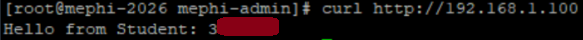

# Учебный проект  
Подготовка минимальной начальной устновки Fedora 43 без графического интерфейса. Настроена работа в локальной сети организации, безопасность в соответствии с политиками и развернут простой web-сервер для публикации модели ML (в будущем).
### Итоговый результат 
Ответ от сервера

